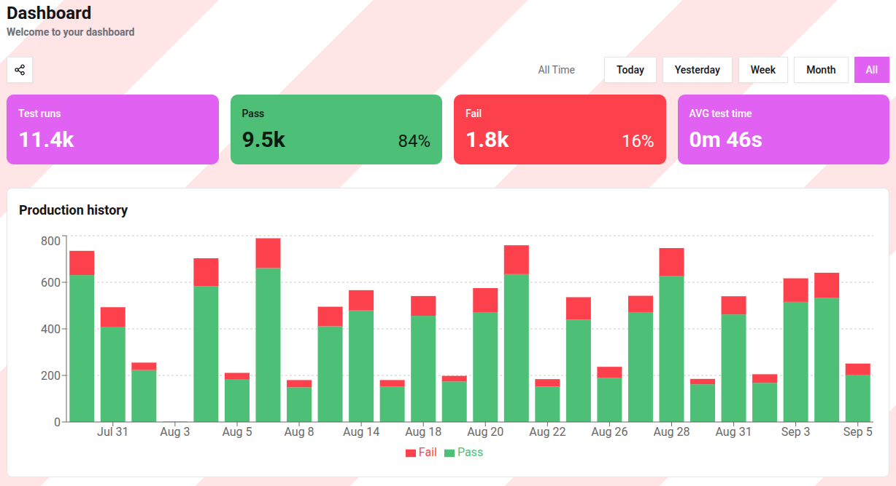
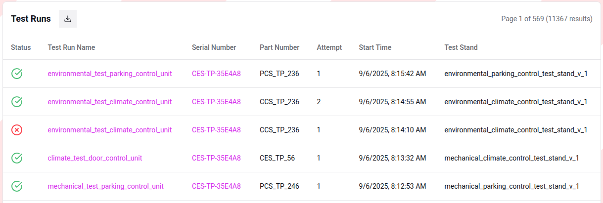

# Home page

The **StandCloud** home page provides a comprehensive overview of your hardware testing processes. 
It is designed to give managers and engineers real-time insights into production quality and testing efficiency.

## Overview

The main landing page is divided into two primary sections: the **Dashboard** and the **Test Runs**. 
These tools allow you to monitor pass/fail rates, identify bottlenecks in testing time, and drill down into specific hardware unit results.

---

## 1. Dashboard

The dashboard serves as the central hub for visualizing production performance over time.

### Summary Statistics
At the top of the page, four key performance indicators (KPIs) provide an instant health check of your testing operations:

* **Test runs:** The total number of tests executed within the selected timeframe.
* **Pass:** The number and percentage of tests that met all criteria.
* **Fail:** The number and percentage of tests that failed one or more criteria.
* **AVG test time:** The mean duration required to complete a single test run.

### Production History Chart
The central bar chart displays the volume of testing activity across specific dates. 
* **Green segments** represent successful test runs (Pass).
* **Red segments** represent failed test runs (Fail).

This visualization helps in identifying specific days with high failure rates or drops in production volume.

### Data Filtering
You can adjust the scope of the dashboard data using the time filters located in the top right corner:
* **Today / Yesterday:** For immediate daily monitoring.
* **Week / Month:** To observe short-to-mid-term trends.
* **All:** To view the entire historical record of the project.

---

## 2. Test Runs

Below the visual analytics, the **Test Runs** section provides a granular, row-by-row look at every individual execution.

### Table Columns
The table includes the following metadata for every test:

| Column | Description |
| :--- | :--- |
| **Status** | Visual indicator (Checkmark for Pass, 'X' for Fail). |
| **Test Run Name** | The specific identifier or type of the test procedure. |
| **Serial Number** | The unique hardware ID of the device under test (DUT). |
| **Part Number** | The manufacturing or component part number. |
| **Attempt** | The iteration count (useful for tracking re-tests of the same unit). |
| **Start Time** | Precise timestamp of when the test run began. |
| **Test Stand** | The specific hardware station or environment where the test was performed. |

### Exporting Data
To perform external analysis or generate reports, you can download the entire dataset currently displayed in the table. 
* Click the **Download icon** (located next to the "Test Runs" header) to export the data in **XLSX** format.

### Navigation
The table supports pagination, allowing you to browse through thousands of results efficiently using the page controls at the top right of the table area.

---

## 3. Evaluation with Demo Mode

For users who are new to the platform or exploring its capabilities, **StandCloud** includes a **Demo Mode**. 

* **Purpose:** To visualize how the system handles large-scale data and complex testing scenarios without requiring a live hardware connection.
* **How to use:** Click the **Enable Demo Mode** toggle/button on the dashboard. 
* **Result:** The system will populate the charts and tables with pre-configured sample data, 
  allowing you to test filters, explore the analytics, and evaluate the interface's functional possibilities immediately.
