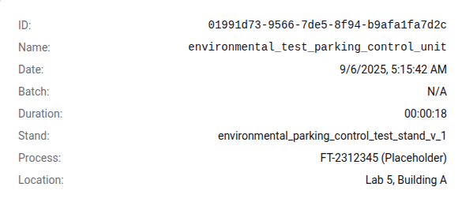
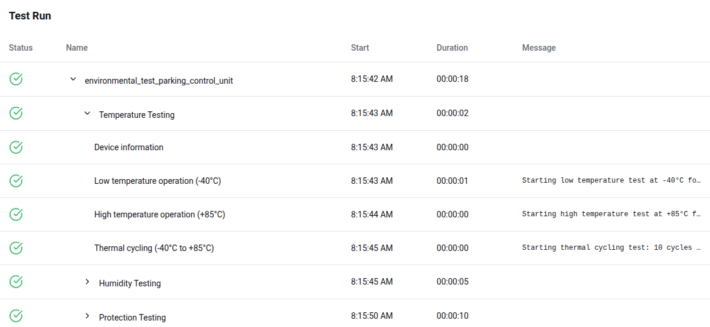

# Test Run Detailed Analysis

The Detailed Analysis page in **StandCloud** provides a deep dive into the execution of a specific test plan. This view is essential for QA specialists and production managers to investigate failures, verify environmental conditions, and audit the testing process for a specific unit.

## Accessing the Analysis Page

To access this page, navigate to the **Test Runs** table on the main dashboard and click on the specific **Test Run Name** you wish to investigate.

---

## 1. Test Run Metadata

At the top of the page, a detailed information card provides the administrative and environmental context for the test. This ensures full traceability of the hardware unit within the production facility.

The following fields are captured:

* **ID:** The unique system UUID for the test execution.
* **Name:** The specific test protocol applied.
* **Date & Duration:** The exact timestamp of the run and the total time elapsed.
* **Batch:** Information regarding the specific production batch (if applicable).
* **Stand:** The physical hardware stand where the unit was mounted.
* **Process:** The specific manufacturing process ID (e.g., Final Test).
* **Location:** The physical lab and building where the test occurred.

---

## 2. Test Execution Details

The **Test Run** section provides a hierarchical tree view of the test plan execution. This allows you to see not just the final result, but the outcome of every individual step and sub-test.

### Navigating the Test Tree
The test plan is organized into logical groups (e.g., **Temperature Testing**, **Humidity Testing**, **Protection Testing**). You can expand these groups to view individual test cases.

### Information Columns
For every step in the process, **StandCloud** displays:

| Field | Description |
| :--- | :--- |
| **Status** | A green checkmark indicates a pass, while a red icon indicates a failure at that specific step. |
| **Name** | The description of the test case (e.g., "High temperature operation (+85°C)"). |
| **Start** | The exact time the specific step began. |
| **Duration** | How long that specific test case took to complete. |
| **Message** | Real-time log output or error messages. This is critical for diagnosing why a unit failed a specific environmental threshold. |

### Diagnostic Logs
The **Message** column provides immediate feedback from the test stand. For example, it may display the start of a thermal cycle or specific sensor readings that triggered a failure. This level of detail allows Product Owners to distinguish between a hardware defect and a test stand calibration issue.
