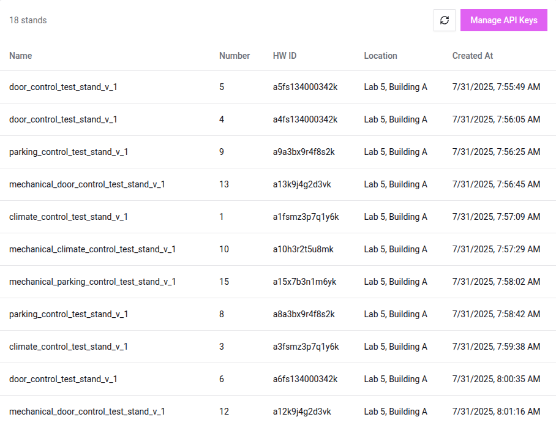
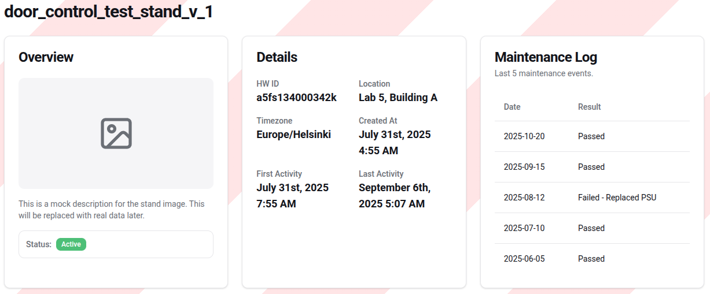
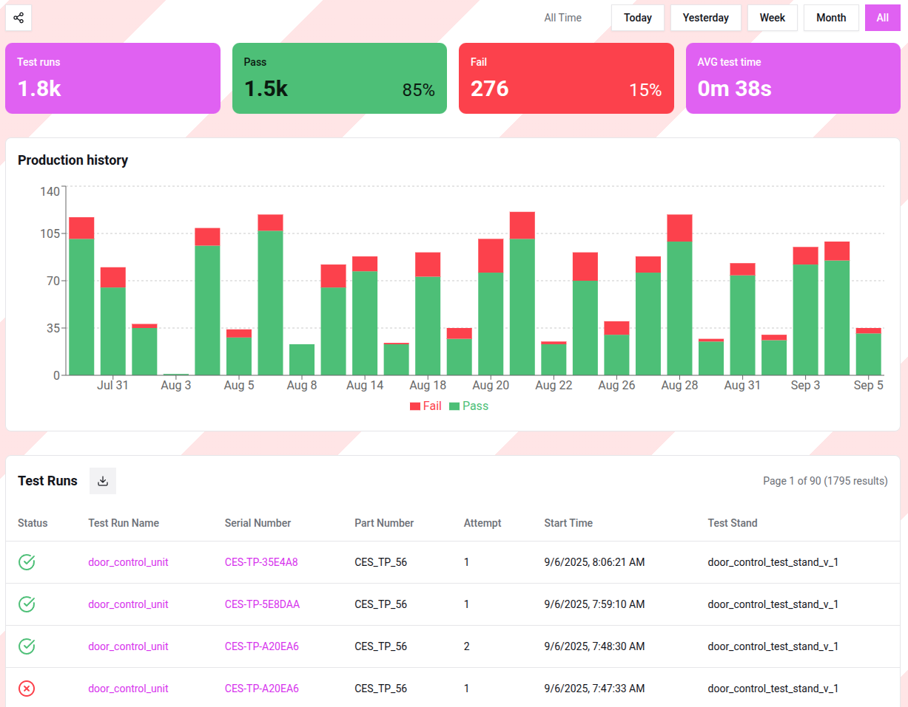

# Test Stands

The Test Stands page in **StandCloud** allows production managers and QA specialists to monitor the health and 
performance of the physical hardware stations connected to the system. 
This centralized view ensures that testing capacity is maintained and that any equipment issues are 
identified before they impact production timelines.

## 1. Stands Overview

The primary list provides a real-time inventory of all testing hardware integrated with **StandCloud**.

### Connectivity and Security
Each physical stand transmits data to **StandCloud** via secure API keys. 
* To manage, rotate, or generate new credentials for your hardware, click the **Manage API Keys** button at the top right of the page.
* Use the **Refresh icon** to update the status of the stands list manually.

### Stand Inventory Table
The table displays the following organizational data:
* **Name:** The functional identifier of the stand (e.g., `door_control_test_stand_v_1`).
* **Number:** The internal unit number assigned to that specific station.
* **HW ID:** The unique hardware identifier of the computer or controller running the test.
* **Location:** The physical facility details (e.g., `Lab 5, Building A`).
* **Created At:** The timestamp when the stand was first registered in **StandCloud**.

---

## 2. Individual Stand Details

Clicking on a stand's name from the list opens a dedicated management page for that specific unit. 
This page is split into technical metadata and performance analytics.

### Hardware Profile and Maintenance
The top section provides a comprehensive profile of the stand's operational status.

* **Overview:** Displays a visual reference of the stand and its current status (e.g., **Active**).
* **Details:** Contains critical deployment data including the local **Timezone**, **First/Last Activity** 
  timestamps, and the specific **HW ID** for technical troubleshooting.
* **Maintenance Log:** A critical tool for production managers to track the reliability of the test equipment. 
  It lists the last 5 maintenance events, showing whether the stand passed its internal checks or required repairs (e.g., "Failed - Replaced PSU").

---

### Stand Performance Dashboard
Below the hardware details, **StandCloud** provides a filtered dashboard specifically for the selected stand. 
This allows you to evaluate if a particular piece of equipment is producing more failures than others, 
which might indicate a calibration issue rather than a product defect.

#### Performance Metrics
* **KPIs:** View total test runs, pass/fail ratios, and average test duration specifically for this station.
* **Production History:** A bar chart showing the daily output of the stand. 
  This is useful for identifying downtime or shifts in testing volume.
* **Filtered Test Runs:** A detailed list of the most recent tests performed *only* on this stand. 
  Like the main dashboard, this table includes serial numbers, timestamps, and the ability to export the data to **XLSX**.
