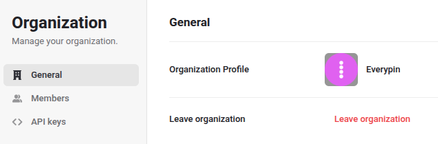
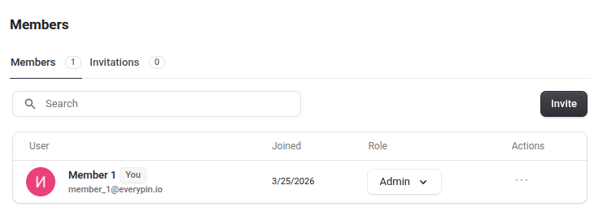
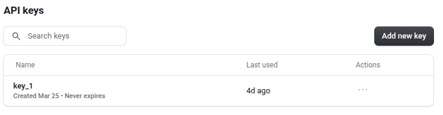

# Get Started

Setting up **StandCloud** is a straightforward process designed to get your production monitoring online quickly. 
This guide covers organization setup, team management, and hardware connectivity.

## 1. Creating Your Organization

To begin using **StandCloud**, you must either create a new organization or be invited to an existing one.

* **Authentication:** Access to the platform is managed through your Google account for secure and seamless login.
* **Organization Profile:** When creating a new organization, you will be prompted to provide a name and an optional 
  organization image to help distinguish your workspace.

Once your organization is active, you will be redirected to the 
[Global Production Dashboard](./../analysis/home.md#1-dashboard). 
If you do not have live hardware connected yet, we recommend exploring the system's 
features using the [Demo Mode](./../analysis/home.md#3-evaluation-with-demo-mode).

---

## 2. Team Management

The user who creates the organization is automatically assigned the **Admin** role. Effective team collaboration is managed through the Members settings.

### Roles and Permissions
Administrators can invite new colleagues to the organization and assign them specific roles:
* **Admin:** Full access to organization settings, member management, and API keys.
* **Member:** Standard access to view dashboards, test runs, and stand analytics.

To invite a team member, click the **Invite** button in the Members tab and enter their professional email address.

---

## 3. Connecting Your Hardware

To stream real-time testing data into **StandCloud**, you must authorize your physical test stands using API keys.

### Generating Keys
1.  Navigate to the **API keys** section in your organization settings.
2.  Click **Add new key**.
3.  Assign a name to the key (e.g., "main_lab_stand") for easy identification.
4.  Securely copy the key; this will be required for your data upload configuration.

### Data Upload Methods
There are two primary ways to transmit hardware test results to **StandCloud**:

* **HardPy Framework:** For teams using the open-source hardware testing framework, integration is built-in. 
  Refer to the [HardPy Documentation](https://everypinio.github.io/hardpy/documentation/stand_cloud/) for configuration details.
* **Direct API Integration:** **IN DEVELOPMENT**.
